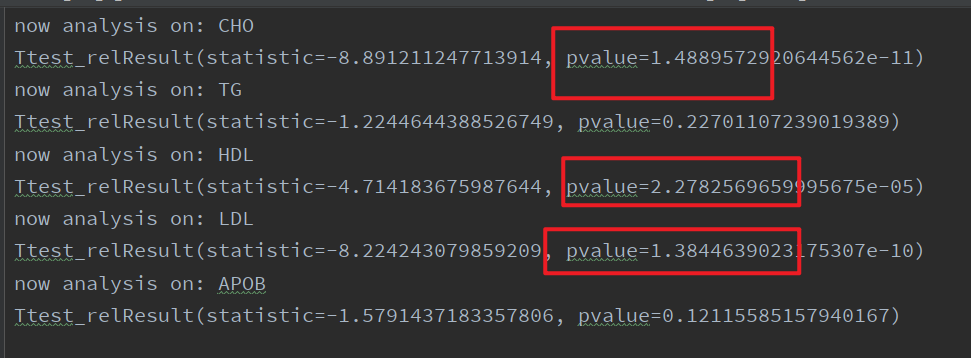
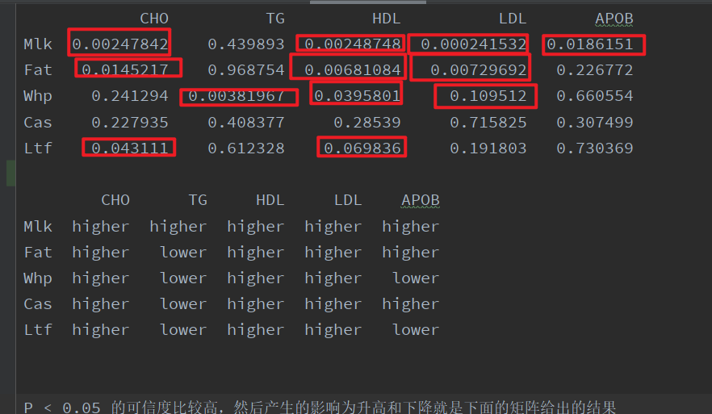
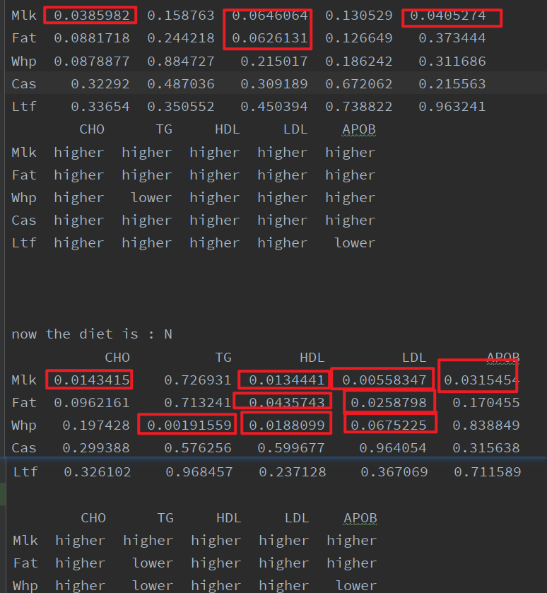
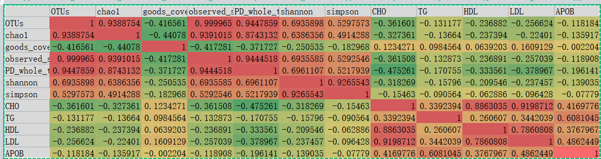
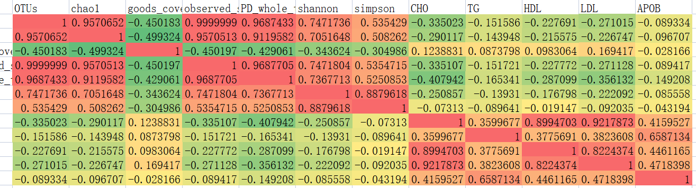
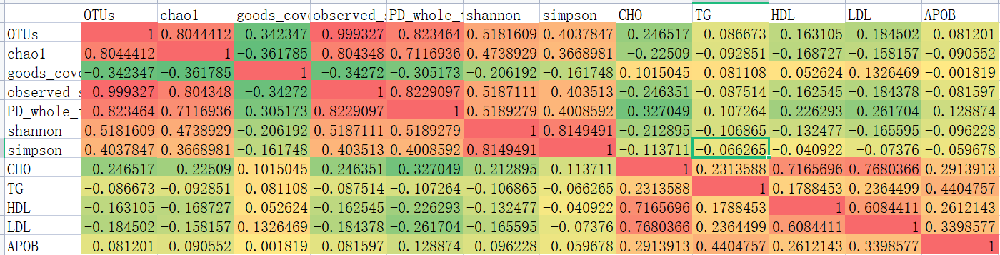

# task (1-9) 包含了所有之前的任务

[toc]

#  * y的解释

ABOP - 载脂蛋白

CHO - 胆固醇

HDL - 高密度载脂蛋白

LDL-低密度脂蛋白

TG - 甘油三酯

## 一、菌群预测血脂

### 1.ABOP

|      | indicator                    | importance  |
| ---- | ---------------------------- | ----------- |
| 2    | g__Ruminiclostridium_9       | 0.18577228  |
| 12   | g__Candidatus_Arthromitus    | 0.1738172   |
| 10   | g__Brachyspira               | 0.13299729  |
| 5    | g__Enterorhabdus             | 0.1154624   |
| 0    | g__Butyricimonas             | 0.09747424  |
| 6    | g__Eubacterium_nodatum_group | 0.09634054  |
| 3    | g__Ruminococcaceae_UCG-010   | 0.07033886  |
| 11   | g__Escherichia-Shigella      | 0.047737915 |
| 13   | g__Desulfovibrio             | 0.04257236  |
| 7    | g__Bacteroides               | 0.037486933 |

r2 = 0.6

### 2. CHO

| indicator                              | importance  |
| -------------------------------------- | ----------- |
| g__Lachnospiraceae_UCG-001             | 0.513369    |
| g__Akkermansia                         | 0.08131584  |
| g__Anaerofustis                        | 0.048180547 |
| g__Lachnospiraceae_UCG-006             | 0.04158378  |
| g__Bifidobacterium                     | 0.030398559 |
| g__Raoultella                          | 0.029358454 |
| g__Family_XIII_UCG-001                 | 0.026231121 |
| g__Coriobacteriaceae_UCG-002           | 0.025697684 |
| g__Peptococcus                         | 0.025301492 |
| g__Ruminiclostridium                   | 0.024441466 |
| g__Alcaligenes                         | 0.02352569  |
| g__Lachnoclostridium                   | 0.021861732 |
| g__Eubacterium_coprostanoligenes_group | 0.020875692 |
| g__Ruminococcaceae_NK4A214_group       | 0.019247517 |
| g__Rikenella                           | 0.013746932 |
| g__Ruminococcaceae_UCG-014             | 0.012969692 |
| g__Acinetobacter                       | 0.012646317 |
| g__Corynebacterium                     | 0.0106057   |
| g__Staphylococcus                      | 0.009539264 |
| g__Ruminococcaceae_UCG-013             | 0.006567374 |
| g__Sutterella                          | 0.002536061 |

### 3.HDL

| indicator                        | importance  |
| -------------------------------- | ----------- |
| g__Peptococcus                   | 0.116295196 |
| g__Lachnospiraceae_UCG-001       | 0.11429342  |
| g__Brumimicrobium                | 0.11282789  |
| g__Eubacterium_fissicatena_group | 0.097769745 |
| g__Ruminiclostridium             | 0.08672803  |
| g__Ruminiclostridium_6           | 0.07062803  |
| g__Ruminococcaceae_UCG-013       | 0.06795467  |
| g__Alcaligenes                   | 0.06537475  |
| g__Ruminococcaceae_NK4A214_group | 0.06333501  |
| g__Corynebacterium               | 0.06286433  |
| g__Rikenella                     | 0.048662536 |
| g__Proteiniclasticum             | 0.038991917 |
| g__Intestinimonas                | 0.01804323  |
| g__Staphylococcus                | 0.016492479 |
| g__Ruminococcaceae_UCG-009       | 0.013714688 |
| g__Gemella                       | 0.004115592 |
| g__Eisenbergiella                | 0.001908495 |

### 4.LDL

| indicator                              | importance  |      |
| -------------------------------------- | ----------- | ---- |
| g__Prevotellaceae_UCG-001              | 0.403344    |      |
| g__Proteus                             | 0.08937988  |      |
| g__Eubacterium_coprostanoligenes_group | 0.0797885   |      |
| g__Paeniclostridium                    | 0.07768903  |      |
| g__Ruminiclostridium                   | 0.062666014 |      |
| g__Family_XIII_AD3011_group            | 0.054025196 |      |
| g__Akkermansia                         | 0.051034395 |      |
| g__Subdoligranulum                     | 0.043491866 |      |
| g__Petrimonas                          | 0.026668867 |      |
| g__Eisenbergiella                      | 0.023764053 |      |
| g__Rikenella                           | 0.021607606 |      |
| g__Family_XIII_UCG-001                 | 0.021583539 |      |
| g__Peptococcus                         | 0.0143744   |      |
| g__Eubacterium_nodatum_group           | 0.012926078 |      |
| g__Ruminiclostridium_9                 | 0.012713277 |      |
| g__Mucispirillum                       | 0.004943353 |      |
|                                        |             |      |
|                                        |             |      |

### 5. TG

| indicator                        | importance  |      |
| -------------------------------- | ----------- | ---- |
| g__Eubacterium_nodatum_group     | 0.11833296  |      |
| g__Ruminiclostridium             | 0.0951098   |      |
| g__wallaby_gut_metagenome        | 0.08830365  |      |
| g__Parvibacter                   | 0.083606854 |      |
| g__Defluviitaleaceae_UCG-011     | 0.072397955 |      |
| g__Anaerofustis                  | 0.07173005  |      |
| g__uncultured                    | 0.05244042  |      |
| g__Coprococcus_1                 | 0.039807968 |      |
| g__Clostridium_sensu_stricto_1   | 0.03737178  |      |
| g__Bacillus                      | 0.036296923 |      |
| g__Peptococcus                   | 0.034585662 |      |
| g__Lachnospiraceae_FCS020_group  | 0.02596825  |      |
| g__Lachnospiraceae_NK4A136_group | 0.0248176   |      |
| g__Stenotrophomonas              | 0.02350106  |      |
| g__Ruminococcaceae_UCG-014       | 0.023433996 |      |
| g__Rikenellaceae_RC9_gut_group   | 0.021326724 |      |
| g__Candidatus_Arthromitus        | 0.020837283 |      |

## 二、代谢预测血脂

### 1. APOB

| meta_1037 | 0.32012546  |
| --------- | ----------- |
| meta_1598 | 0.23139223  |
| meta_2475 | 0.13482167  |
| meta_3601 | 0.10238553  |
| meta_1164 | 0.09180748  |
| meta_513  | 0.090527415 |
| meta_306  | 0.028940175 |

### 2.CHO

| indicator | importance  |
| --------- | ----------- |
| meta_3347 | 0.45055845  |
| meta_3676 | 0.1757681   |
| meta_2022 | 0.11003604  |
| meta_2745 | 0.06282793  |
| meta_1526 | 0.034049217 |
| meta_1298 | 0.033142205 |
| meta_178  | 0.016425721 |
| meta_100  | 0.016340382 |
| meta_3217 | 0.014199987 |
| meta_2519 | 0.01065231  |
| meta_3661 | 0.009694358 |
| meta_887  | 0.009013037 |
| meta_3056 | 0.008951274 |
| meta_3726 | 0.008881214 |
| meta_1224 | 0.008260241 |
| meta_513  | 0.006789001 |
| meta_2900 | 0.005503598 |
| meta_2111 | 0.004624958 |
| meta_3515 | 0.003370323 |
| meta_3816 | 0.001945547 |
| meta_54   | 0.001876128 |
| meta_2078 | 0.001703694 |
| meta_2506 | 0.001268093 |
| meta_1010 | 0.001237545 |
| meta_2592 | 0.00099413  |
| meta_460  | 0.00061358  |
| meta_848  | 0.000518664 |
| meta_1814 | 0.000447036 |
| meta_3688 | 0.000307164 |

### 3.HDL

| indicator | importance  |
| --------- | ----------- |
| meta_3347 | 0.45055845  |
| meta_3676 | 0.1757681   |
| meta_2022 | 0.11003604  |
| meta_2745 | 0.06282793  |
| meta_1526 | 0.034049217 |
| meta_1298 | 0.033142205 |
| meta_178  | 0.016425721 |
| meta_100  | 0.016340382 |
| meta_3217 | 0.014199987 |
| meta_2519 | 0.01065231  |
| meta_3661 | 0.009694358 |
| meta_887  | 0.009013037 |
| meta_3056 | 0.008951274 |
| meta_3726 | 0.008881214 |
| meta_1224 | 0.008260241 |
| meta_513  | 0.006789001 |
| meta_2900 | 0.005503598 |
| meta_2111 | 0.004624958 |
| meta_3515 | 0.003370323 |
| meta_3816 | 0.001945547 |
| meta_54   | 0.001876128 |
| meta_2078 | 0.001703694 |
| meta_2506 | 0.001268093 |
| meta_1010 | 0.001237545 |
| meta_2592 | 0.00099413  |
| meta_460  | 0.00061358  |
| meta_848  | 0.000518664 |
| meta_1814 | 0.000447036 |
| meta_3688 | 0.000307164 |

### 4.LDL

| indicator | importance  |
| --------- | ----------- |
| meta_3347 | 0.3765333   |
| meta_1013 | 0.16867188  |
| meta_54   | 0.08158765  |
| meta_2701 | 0.045828104 |
| meta_2433 | 0.03565531  |
| meta_91   | 0.033499684 |
| meta_42   | 0.0328783   |
| meta_3578 | 0.031414077 |
| meta_3079 | 0.025638403 |
| meta_41   | 0.021086784 |
| meta_1176 | 0.018446324 |
| meta_145  | 0.017058449 |
| meta_1903 | 0.01704968  |
| meta_3254 | 0.015656687 |
| meta_2096 | 0.012245665 |
| meta_3222 | 0.010916482 |
| meta_1571 | 0.008327984 |
| meta_640  | 0.008186299 |
| meta_734  | 0.007410448 |
| meta_3016 | 0.005602421 |
| meta_3247 | 0.005353801 |
| meta_1256 | 0.004192623 |
| meta_178  | 0.002750201 |
| meta_2783 | 0.002425674 |
| meta_252  | 0.001876592 |
| meta_2123 | 0.001795855 |
| meta_294  | 0.00162075  |
| meta_3701 | 0.001574654 |
| meta_736  | 0.001378832 |
| meta_2673 | 0.001213235 |
| meta_3220 | 0.000944601 |
| meta_521  | 0.000801005 |
| meta_422  | 0.000378182 |
| meta_2340 | 0           |

### 5. TG

| indicator | importance  |
| --------- | ----------- |
| meta_854  | 0.25055295  |
| meta_3165 | 0.15331016  |
| meta_2890 | 0.09511188  |
| meta_3049 | 0.06893401  |
| meta_3220 | 0.06284195  |
| meta_1616 | 0.047832735 |
| meta_1667 | 0.044986367 |
| meta_2879 | 0.0446377   |
| meta_2313 | 0.039062575 |
| meta_1419 | 0.033232696 |
| meta_3865 | 0.032438997 |
| meta_966  | 0.030427227 |
| meta_3510 | 0.020303482 |
| meta_2604 | 0.017879419 |
| meta_2832 | 0.017342914 |
| meta_622  | 0.016571445 |
| meta_904  | 0.011993955 |
| meta_247  | 0.008063553 |
| meta_3086 | 0.004475978 |

## 三、 代谢+菌群 预测血脂

### 1.APOB

| indicator        | importance  |
| ---------------- | ----------- |
| meta_513         | 0.37149453  |
| meta_1037        | 0.18649437  |
| meta_1598        | 0.10056128  |
| meta_1164        | 0.054356053 |
| meta_1233        | 0.043615784 |
| meta_2475        | 0.037707716 |
| meta_428         | 0.03104912  |
| meta_3601        | 0.02616686  |
| meta_3624        | 0.022732055 |
| meta_25          | 0.017869413 |
| meta_87          | 0.016526723 |
| meta_2232        | 0.015280829 |
| meta_2246        | 0.013249362 |
| meta_3125        | 0.010899357 |
| meta_3656        | 0.00869548  |
| meta_1263        | 0.008309792 |
| meta_306         | 0.008231867 |
| meta_3267        | 0.005985181 |
| g__Delftia       | 0.004462399 |
| meta_1599        | 0.003839554 |
| meta_2278        | 0.003006375 |
| meta_2394        | 0.002746932 |
| g__Desulfovibrio | 0.001985679 |
| meta_2831        | 0.001031951 |
| meta_3541        | 0.001013817 |
| g__Bilophila     | 0.000975999 |
| meta_2467        | 0.000940818 |
| meta_848         | 0.000770631 |

### 2.CHO

| indicator         | importance  |
| ----------------- | ----------- |
| meta_3347         | 0.3985097   |
| meta_2022         | 0.15231012  |
| meta_2745         | 0.124348626 |
| meta_1814         | 0.08777825  |
| meta_54           | 0.08729992  |
| meta_1526         | 0.08233999  |
| meta_3726         | 0.021445688 |
| meta_2078         | 0.013937589 |
| meta_3217         | 0.009452724 |
| meta_2506         | 0.007280646 |
| meta_2592         | 0.006756728 |
| g__Intestinimonas | 0.005146831 |
| meta_848          | 0.003393107 |

### 3.HDL

| indicator | importance  |
| --------- | ----------- |
| meta_854  | 0.25055295  |
| meta_3165 | 0.15331016  |
| meta_2890 | 0.09511188  |
| meta_3049 | 0.06893401  |
| meta_3220 | 0.06284195  |
| meta_1616 | 0.047832735 |
| meta_1667 | 0.044986367 |
| meta_2879 | 0.0446377   |
| meta_2313 | 0.039062575 |
| meta_1419 | 0.033232696 |
| meta_3865 | 0.032438997 |
| meta_966  | 0.030427227 |
| meta_3510 | 0.020303482 |
| meta_2604 | 0.017879419 |
| meta_2832 | 0.017342914 |
| meta_622  | 0.016571445 |
| meta_904  | 0.011993955 |
| meta_247  | 0.008063553 |
| meta_3086 | 0.004475978 |

### 4.LDL

| indicator | importance  |
| --------- | ----------- |
| meta_91   | 0.063547626 |
| meta_736  | 0.003452612 |
| meta_734  | 0.010556334 |
| meta_640  | 0.006230126 |
| meta_54   | 0.1278237   |
| meta_521  | 0.001195659 |
| meta_42   | 0.027691083 |
| meta_41   | 0.01875852  |
| meta_3701 | 0.004588011 |
| meta_3578 | 0.031781163 |
| meta_3347 | 0.2882698   |
| meta_3254 | 0.038153406 |
| meta_3247 | 0.000101529 |
| meta_3222 | 0.010431154 |
| meta_3220 | 0.000862649 |
| meta_3079 | 0.009731354 |
| meta_3016 | 0.012102157 |
| meta_294  | 0.001145415 |
| meta_2783 | 0.002382094 |
| meta_2701 | 0.12083352  |
| meta_2673 | 0.002514441 |
| meta_252  | 0.007212919 |
| meta_2433 | 0.02636939  |
| meta_2340 | 0.000232113 |
| meta_2123 | 0.001646389 |
| meta_2096 | 0.009299173 |
| meta_1903 | 0.008252405 |
| meta_178  | 0.001783646 |
| meta_1571 | 0.010840187 |
| meta_145  | 0.023873337 |
| meta_1256 | 0.004888673 |
| meta_1176 | 0.00743647  |
| meta_1013 | 0.116013005 |

### 5.TG

| indicator                    | importance  |
| ---------------------------- | ----------- |
| meta_379                     | 0.22557458  |
| g__Eubacterium_nodatum_group | 0.16474618  |
| meta_605                     | 0.082733385 |
| meta_2987                    | 0.06882009  |
| meta_2879                    | 0.05707252  |
| meta_58                      | 0.053775128 |
| meta_1874                    | 0.049035348 |
| meta_132                     | 0.04220137  |
| meta_1222                    | 0.03321517  |
| meta_706                     | 0.030535456 |
| meta_3675                    | 0.029542841 |
| g__Lachnospiraceae_UCG-006   | 0.027169235 |
| meta_972                     | 0.023130381 |
| meta_3595                    | 0.016995434 |
| meta_1412                    | 0.015985716 |
| meta_1751                    | 0.015133245 |
| meta_302                     | 0.010940618 |
| meta_2855                    | 0.010785459 |
| meta_3246                    | 0.008407531 |
| meta_1314                    | 0.006476549 |
| meta_2971                    | 0.006283758 |
| meta_887                     | 0.005926163 |
| meta_137                     | 0.003288793 |
| meta_3688                    | 0.002491955 |
| meta_3416                    | 0.002230052 |
| meta_3269                    | 0.002188604 |
| g__Blautia                   | 0.002082545 |
| meta_3282                    | 0.001263854 |
| meta_3078                    | 0.000903088 |
| meta_37                      | 0.000648051 |
| meta_3625                    | 0.000416922 |

## 四、 diet,interventions,bodyweight,alpha多样性,g__xxxx和meta_xxxx 预测血脂

### 1.ABOP

| indicator        | importance  |
| ---------------- | ----------- |
| meta_513         | 0.17798331  |
| meta_1037        | 0.14812203  |
| meta_1598        | 0.11910531  |
| meta_2475        | 0.09206239  |
| meta_1164        | 0.08422267  |
| meta_1233        | 0.08015132  |
| meta_428         | 0.045457833 |
| meta_3624        | 0.032659765 |
| meta_3601        | 0.029456425 |
| meta_87          | 0.027470266 |
| meta_2232        | 0.026886942 |
| meta_25          | 0.020304821 |
| meta_2246        | 0.019918581 |
| meta_1263        | 0.019783752 |
| meta_3125        | 0.014162323 |
| meta_306         | 0.010011078 |
| meta_3656        | 0.009749138 |
| meta_3541        | 0.00960784  |
| meta_3267        | 0.009034537 |
| meta_2278        | 0.00864714  |
| meta_2394        | 0.006282876 |
| meta_1599        | 0.003548126 |
| meta_2831        | 0.001960505 |
| meta_848         | 0.001152967 |
| meta_2467        | 0.000923345 |
| g__Bilophila     | 0.000876197 |
| g__Desulfovibrio | 0.000458544 |

### 2.CHO

| indicator                        | importance  |
| -------------------------------- | ----------- |
| bodyweight                       | 0.32158482  |
| meta_2022                        | 0.22353487  |
| meta_2862                        | 0.0673383   |
| meta_1771                        | 0.060414337 |
| meta_1526                        | 0.050228857 |
| meta_1298                        | 0.044081613 |
| meta_55                          | 0.03149752  |
| meta_3698                        | 0.031492144 |
| meta_358                         | 0.02812464  |
| g__Rikenella                     | 0.022040643 |
| meta_3048                        | 0.01727888  |
| meta_2519                        | 0.015152094 |
| meta_3045                        | 0.012924895 |
| meta_3217                        | 0.011941618 |
| meta_2892                        | 0.011410612 |
| meta_1673                        | 0.008521803 |
| meta_736                         | 0.007952306 |
| meta_3805                        | 0.006943558 |
| meta_2348                        | 0.005583669 |
| meta_2242                        | 0.00498562  |
| meta_1411                        | 0.004976682 |
| meta_2506                        | 0.004614945 |
| meta_2153                        | 0.002451677 |
| meta_2606                        | 0.002355421 |
| g__Eubacterium_fissicatena_group | 0.001117804 |
| g__Coriobacteriaceae_UCG-002     | 0.000819842 |
| g__Staphylococcus                | 0.000630922 |
| meta_1245                        | 0           |

### 3.HDL

| indicator  | importance  |
| ---------- | ----------- |
| meta_474   | 0.26765662  |
| meta_3496  | 0.18519019  |
| bodyweight | 0.15283325  |
| meta_2242  | 0.06888303  |
| meta_3018  | 0.06864074  |
| meta_3056  | 0.057155628 |
| meta_295   | 0.036927257 |
| meta_3347  | 0.03598589  |
| meta_2753  | 0.03459313  |
| meta_3559  | 0.032657005 |
| meta_2173  | 0.03158373  |
| meta_2864  | 0.01611485  |
| meta_734   | 0.006779447 |
| meta_732   | 0.003417483 |
| g__Gemella | 0.001581729 |

### 4.LDL

| indicator  | importance  |
| ---------- | ----------- |
| bodyweight | 0.135654    |
| meta_1013  | 0.11038989  |
| meta_1067  | 0.10952703  |
| meta_583   | 0.08749005  |
| meta_1222  | 0.07107552  |
| meta_61    | 0.06088519  |
| meta_3204  | 0.05010819  |
| meta_994   | 0.044544663 |
| meta_1778  | 0.042549286 |
| meta_145   | 0.03710652  |
| meta_3770  | 0.03239978  |
| meta_1293  | 0.031719826 |
| meta_1965  | 0.025846196 |
| meta_1400  | 0.023670979 |
| meta_3831  | 0.018424615 |
| meta_3481  | 0.014915987 |
| meta_3699  | 0.014088634 |
| meta_3129  | 0.011371457 |
| meta_1377  | 0.010583961 |
| meta_3252  | 0.009627884 |
| meta_3037  | 0.007547083 |
| meta_44    | 0.007475595 |
| meta_3222  | 0.007220753 |
| meta_179   | 0.00690583  |
| meta_2078  | 0.006076426 |
| meta_3120  | 0.004783382 |
| meta_3664  | 0.004513783 |
| meta_2953  | 0.003741325 |
| meta_3266  | 0.003465531 |
| meta_2123  | 0.002747227 |
| meta_2467  | 0.001773408 |
| meta_3570  | 0.001770007 |

### 5.TG

| indicator                    | importance  |
| ---------------------------- | ----------- |
| meta_379                     | 0.2250372   |
| meta_58                      | 0.106892936 |
| meta_3338                    | 0.10516424  |
| g__Eubacterium_nodatum_group | 0.08021717  |
| meta_3246                    | 0.062088914 |
| meta_2879                    | 0.049437597 |
| meta_605                     | 0.04473036  |
| meta_706                     | 0.044146575 |
| meta_2134                    | 0.040982086 |
| meta_1751                    | 0.03678114  |
| meta_1412                    | 0.032165743 |
| meta_972                     | 0.028368164 |
| meta_82                      | 0.01990501  |
| meta_1874                    | 0.018860918 |
| meta_1101                    | 0.015680969 |
| meta_3675                    | 0.01314384  |
| meta_132                     | 0.011129517 |
| meta_889                     | 0.009052738 |
| meta_1222                    | 0.007247098 |
| meta_3595                    | 0.006881506 |
| meta_2855                    | 0.006734734 |
| meta_302                     | 0.006635595 |
| meta_2502                    | 0.005768026 |
| meta_137                     | 0.005375617 |
| meta_3078                    | 0.004320776 |
| meta_3625                    | 0.003996987 |
| meta_3269                    | 0.002391952 |
| meta_2189                    | 0.001599058 |
| g__Staphylococcus            | 0.001179552 |
| meta_3688                    | 0.001041797 |
| meta_2971                    | 0.000722872 |
| g__Blautia                   | 0.000649412 |
| meta_2969                    | 0.000627279 |
| meta_2987                    | 0.000502869 |
| meta_1314                    | 0.00024719  |
| meta_887                     | 0.000161871 |
| meta_3282                    | 0.000130676 |
| meta_37                      | 0           |
| meta_3416                    | 0           |

## 五、菌群和代谢产物有什么关系（g__xxxx和meta_xxxx的spearman系数）

## 六、diet 的N H 影响

## 七、interventions：多个 ，用是否来区分 判断他们对血脂的影响

## 八、 diet和intervention组合

## 九、血脂和alpha多样性

一个问题 只是不代表线性相关

### spearman

### 用模型分析

now the name is CHO now anylisis y 0 :-----------------------------
(76,)
xgboost,此次搜索结果： {'max_depth': 6, 'min_child_weight': 6, 'n_estimators': 41} xgboost训练集准确率: 0.10470018295416997
xgboost测试集上的r2为： -0.5452808504070201 SVR训练集准确率: 0.11613427390975781 SVR测试集上的r2为： -0.0699924837004986 Lasso获得最佳参数为：
{'alpha': 0.01} Lasso训练集准确率: 0.06210721272190951 测试集上的r2为： 0.004017649460910877 Ridge： {'alpha': 0.01} Ridge训练集准确率:
0.1702016161937921 Ridge测试集上的r2为： -0.10479842838070152
(76,)
随机森林,此次搜索结果： {'max_depth': 55} 随机森林训练集准确率: 0.07081709742456735 随机森林测试集上的r2为： -0.11323641021399378 now the name is TG now
anylisis y 1 :-----------------------------
(76,)
xgboost,此次搜索结果： {'max_depth': 1, 'min_child_weight': 31, 'n_estimators': 21} xgboost训练集准确率: -0.2146473201173802
xgboost测试集上的r2为： -0.12036298042605353 SVR训练集准确率: -0.3710049542600605 SVR测试集上的r2为： -0.2581017006929194 Lasso获得最佳参数为：
{'alpha': 0.11} Lasso训练集准确率: -0.27268353038038695 测试集上的r2为： -0.05396819563427813 Ridge： {'alpha': 1.0} Ridge训练集准确率:
-0.3189260332719577 Ridge测试集上的r2为： -0.0793266086187141
(76,)
随机森林,此次搜索结果： {'max_depth': 1} 随机森林训练集准确率: -0.3367774668629139 随机森林测试集上的r2为： -0.12836981359912203 now the name is HDL now
anylisis y 2 :-----------------------------
(76,)
xgboost,此次搜索结果： {'max_depth': 1, 'min_child_weight': 15, 'n_estimators': 41} xgboost训练集准确率: -0.011093421110312085
xgboost测试集上的r2为： -0.24592960645848594 SVR训练集准确率: -0.22616948519187147 SVR测试集上的r2为： -0.3456090087726793 Lasso获得最佳参数为：
{'alpha': 0.01} Lasso训练集准确率: -0.03902070070605125 测试集上的r2为： -0.11546797102632 Ridge： {'alpha': 0.03} Ridge训练集准确率:
0.0674966598812912 Ridge测试集上的r2为： -0.20307161013366049
(76,)
随机森林,此次搜索结果： {'max_depth': 1} 随机森林训练集准确率: -0.04208638357920051 随机森林测试集上的r2为： -0.16678367483325185 now the name is LDL
now anylisis y 3 :-----------------------------
(76,)
xgboost,此次搜索结果： {'max_depth': 3, 'min_child_weight': 3, 'n_estimators': 11} xgboost训练集准确率: 0.055721182798420144
xgboost测试集上的r2为： 0.1569810001535945 SVR训练集准确率: -0.46076830067016256 SVR测试集上的r2为： -0.5511911828288558 Lasso获得最佳参数为：
{'alpha': 0.01} Lasso训练集准确率: -0.09805283401471479 测试集上的r2为： 0.017984671863897517 Ridge： {'alpha': 0.01} Ridge训练集准确率:
0.04563019217627253 Ridge测试集上的r2为： 0.07213438276789097
(76,)
随机森林,此次搜索结果： {'max_depth': 37} 随机森林训练集准确率: 0.09326458281225189 随机森林测试集上的r2为： -0.12332907031758245 now the name is APOB
now anylisis y 4 :-----------------------------
(76,)
xgboost,此次搜索结果： {'max_depth': 3, 'min_child_weight': 17, 'n_estimators': 11} xgboost训练集准确率: -0.20228464832946255
xgboost测试集上的r2为： -0.20236082161272595 SVR训练集准确率: -1.2344743786055905 SVR测试集上的r2为： -0.19457536211147564 Lasso获得最佳参数为：
{'alpha': 0.01} Lasso训练集准确率: -0.346547016491258 测试集上的r2为： -0.007787585658498353 Ridge： {'alpha': 1.0} Ridge训练集准确率:
-0.32845983334051043 Ridge测试集上的r2为： -0.04674515337987506
(76,)
随机森林,此次搜索结果： {'max_depth': 1} 随机森林训练集准确率: -0.3458200642322887 随机森林测试集上的r2为： -0.06545708300537756

### pearson

### kendall

